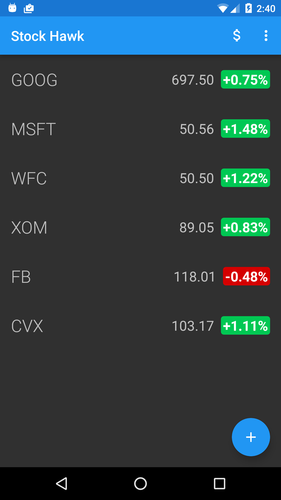
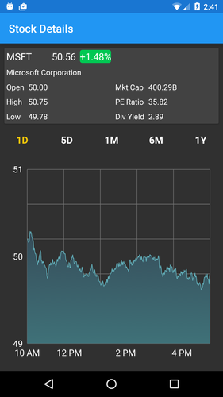
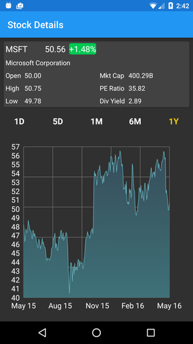

## Stock Hawk - Project 3 for Udacity Android Nanodegree

In this project I updated a sample stock ticker app to add stock charting and an app widget to show stock quotes on the device home screen.

### Author
[Dave Allen](https://github.com/debun8)

### Credits
Tip - [How to set up a Content Observer](https://android.googlesource.com/platform/development/+/master/samples/WeatherListWidget/src/com/example/android/weatherlistwidget/WeatherWidgetProvider.java) that updates the widget collection when the data source has changed

### License
Apache 2.0 See the LICENSE file for details

## Comments on the Project
- This was a good 'real world' project, I learned how to get, parse and chart financial data.
- I also learned how to do an AppWidget.

----

## The Assignment

### What Will I Learn?

* How to get stock market history data with the Yahoo Finance API
* How to parse that data and use it to draw stock charts
* How to create an Android AppWidget that lives on the device home screen and shows a collection of stock quotes
* Use Google Cloud Messaging (GCM) Network Manager service to do periodic and one-off network requests
* Use an Android Content Provider to store and query stock market data

# Rubric

* Each stock quote on the main screen is clickable and leads to a new screen which graphs the stock’s value over time.
* Stock Hawk Stocks can be displayed in a collection widget.
* Stock Hawk supports layout mirroring using both the RTL attribute and the start/end tags.
* Stock Hawk supports basic Accessibility Standards by having content descriptions for all buttons.
* Stock Hawk does not crash when a user searches for a non-existent stock.
* Stock Hawk handles network problems gracefully.
